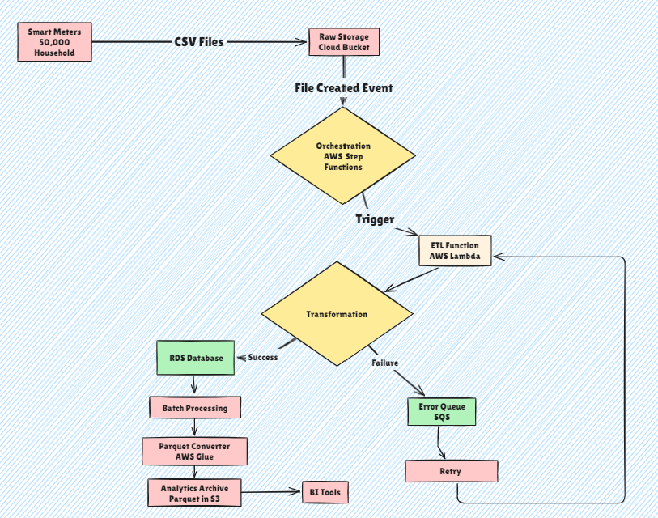

# 🏗️ Energy Data ETL Pipeline Project

This repository contains the documentation and logic for an automated ETL (Extract, Transform, Load) pipeline designed for smart meter energy data.

---

## 📍 Task A: System Design
### **ETL Architecture Diagram**
The following diagram illustrates the data flow from raw smart meter ingestion to structured storage and archival.

---

## 📜 Task B: Business Logic & Data Governance
This section defines the rigorous rules applied during the transformation phase to ensure data integrity and reliability.

### **1. Unit Standardization**
| Rule ID | Condition | Action |
| :--- | :--- | :--- |
| **Rule 1** | `energy_unit == "W"` | Convert to `kW` (Value / 1000) |
| **Rule 2** | `energy_unit` in `["kwh", "KWH"]` | Standardize naming to `"kW"` |
| **Rule 3** | `energy_unit` NOT IN `["W", "kW"]` | Default to `"kW"` & Flag `ASSUMED_UNIT` |

### **2. Handling Missing Values**
| Rule ID | Condition | Action / Status |
| :--- | :--- | :--- |
| **Rule 4** | `energy_value` IS NULL | Status: `MISSING_VALUE` + Exclude from calculations |
| **Rule 5** | `timestamp` IS NULL | Infer time (`prev + 15m`) + Status: `INFERRED_TIME` |
| **Rule 6** | `meter_id` IS NULL | 🚨 **REJECT RECORD COMPLETELY** |

### **3. Data Validation & Quality**
| Rule ID | Condition | Action / Status |
| :--- | :--- | :--- |
| **Rule 7** | `energy_value < 0` | Status: `INVALID_NEGATIVE` + Reject from analytics |
| **Rule 8** | `value > 50kW` (Residential) | Status: `SUSPICIOUSLY_HIGH` + Manual review |
| **Rule 9** | `ABS(change) > 30kW` (15 min) | Status: `ABRUPT_CHANGE` |
| **Rule 10** | `timestamp > current + 5m` | Status: `TIME_CORRECTED` (Set to current time) |

### **4. Faulty Meter Detection**
> ⚠️ **Proactive Maintenance:** These rules help identify hardware issues and connectivity problems automatically.

| Rule ID | Issue | Condition | Action / Status |
| :--- | :--- | :--- | :--- |
| **Rule 11** | **Zero Consumption** | `0` value for 24 consecutive hours | `POTENTIAL_FAULTY` + Ticket |
| **Rule 12** | **Stuck Meter** | Std Dev `< 0.01` over 48 hours | `POTENTIAL_STUCK_METER` |
| **Rule 13** | **Suspicious Pattern**| All identical values detected | `SUSPICIOUS_PATTERN` |
| **Rule 14** | **Abnormally Low** | `< 10%` of neighborhood avg (7 days) | `ABNORMALLY_LOW` |
| **Rule 15** | **Connectivity** | No readings for `> 72 hours` | `OFFLINE` + Alert |

---

## ⚙️ Task C: Data Pipeline Execution Flow

### **1. Ingestion (Raw Storage)**
Raw CSV data (e.g., `meter_id=123, energy=500, unit=W`) lands in an **S3 Bucket (Landing Zone)** via API. This preserves the "Single Source of Truth" for auditing.

### **2. Orchestration (Trigger)**
An S3 Event triggers an **AWS Lambda** function. 
* **Retry Logic:** Automatic 3x retry on initial trigger failure before logging for manual intervention.

### **3. Transformation Layer**
The transformation process performs:
* **Parsing & Cleaning:** Extracts fields and standardizes units (e.g., `500W` → `0.5kW`).
* **Validation:** Checks for nulls, range limits (0-50 kW), and abrupt changes.
* **Enrichment:** Adds UTC timestamps, processing IDs, and Quality Scores.

### **4. Structured Loading (RDS)**
Cleaned data is loaded into an **RDS SQL Table** (`cleaned_readings`). 
* **Purpose:** Enables immediate SQL queries for peak detection and real-time monitoring.
* **Resilience:** Uses **Exponential Backoff**; persistent failures move to Dead Letter Queue (DLQ).

### **5. Analytical Archiving (Parquet)**
Simultaneously, data is converted to **Apache Parquet** format.
* **Efficiency:** Columnar format reduces storage by ~80% and optimizes analytical queries.
* **Organization:** Partitioned by `date/hour/meter_id` for long-term trend detection.

### **6. Error Handling & Success Policy**
* ✅ **On Success:** Metrics logged; data becomes available for dashboards and forecasting.
* ❌ **On Failure:** Records are routed to a **DLQ** for inspection, an **SNS Alert** is triggered, and invalid data is blocked from downstream systems to maintain data quality.

---

### **Next Steps**
* [ ] Integrate Grafana for real-time energy consumption dashboards.
* [ ] Implement automated maintenance ticket generation via Jira API for Rule 11.
