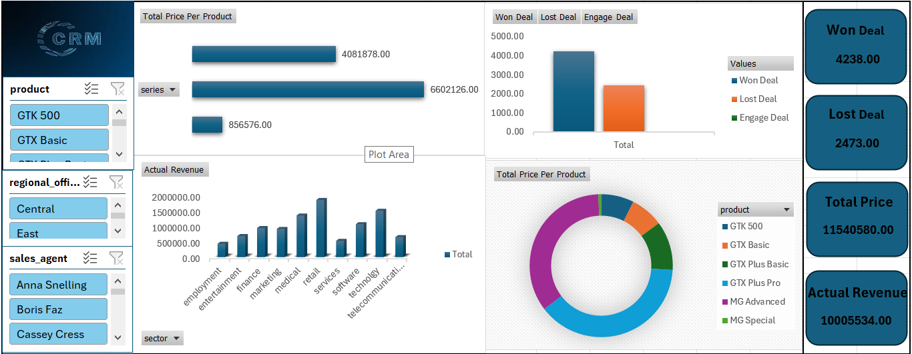
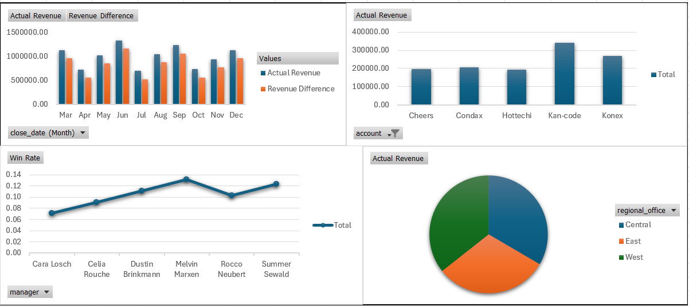

# 🧩 CRM Sales Performance Dashboard

## 📊 Overview
This project contains an **interactive Power BI dashboard** designed to analyze and visualize **CRM sales performance** across different dimensions such as products, sales agents, regions, and accounts.  
The dashboard helps management monitor **deal outcomes**, **revenue trends**, and **sales performance** to support better business decisions.

---

## 🧠 Objectives
- Track **Won**, **Lost**, and **Engaged** deals over time.  
- Analyze **total and actual revenue** by product, region, sector, and account.  
- Evaluate **sales agent** and **manager performance**.  
- Visualize **monthly revenue differences** and **win rates** to identify trends and insights.

---

## 📁 Dashboard Pages

### **1️⃣ Page 1: Sales Overview**


**Key Insights:**
- 💰 **Total Price per Product** (bar + donut charts).  
- 🏆 **Won, Lost, Engage Deals** (bar chart).  
- 🏢 **Actual Revenue by Sector** (bar chart).  
- 📦 **Product, Regional Office, Sales Agent Filters** for dynamic analysis.  
- 📈 KPI Cards showing:
  - **Won Deal**
  - **Lost Deal**
  - **Total Price**
  - **Actual Revenue**

---

### **2️⃣ Page 2: Performance Analysis**


**Key Insights:**
- 📅 **Actual Revenue vs Revenue Difference by Month** — monthly performance comparison.  
- 🧾 **Revenue by Account** — top-performing accounts.  
- 🧭 **Revenue by Regional Office** — regional performance distribution (pie chart).  
- 👔 **Win Rate by Manager** — performance trend line for each manager.

---

## 🧰 Tools & Technologies
- **Power BI Desktop**
- **Data Model:** Star schema with:
  - Fact table: `sales_pipeline`
  - Dimension tables: `products`, `sales_teams`, `accounts`
- **Data Source:** Simulated CRM sales data

---

## 🧮 DAX Measures (Examples)
```DAX
Actual Revenue = SUM(sales_pipeline[close_value])

Won Deal = COUNTROWS(
    FILTER(sales_pipeline, sales_pipeline[deal_stage] = "Won")
)

Lost Deal = COUNTROWS(
    FILTER(sales_pipeline, sales_pipeline[deal_stage] = "Lost")
)

Total Price = SUMX(sales_pipeline, sales_pipeline[close_value])

Win Rate = DIVIDE([Won Deal], [Won Deal] + [Lost Deal])
```
## 👥 Contributers

| [](https://github.com/anas7abdelghany) | [](https://github.com/khloudemad) |
|:--:|:--:|
| <span style="color:#58a6ff; font-weight:bold;">Anas Abdelghany</span> | <span style="color:#58a6ff; font-weight:bold;">Khloud Emad</span> |
| <span style="color:#8ab4f8;">👨‍💻 Data Science Student</span> | <span style="color:#8ab4f8;">👨‍💻 Data Science Student</span> |
| [<span style="color:#58a6ff;">🔗 GitHub Profile</span>](https://github.com/anas7abdelghany) | [<span style="color:#58a6ff;">🔗 GitHub Profile</span>](https://github.com/khloudemad) |
