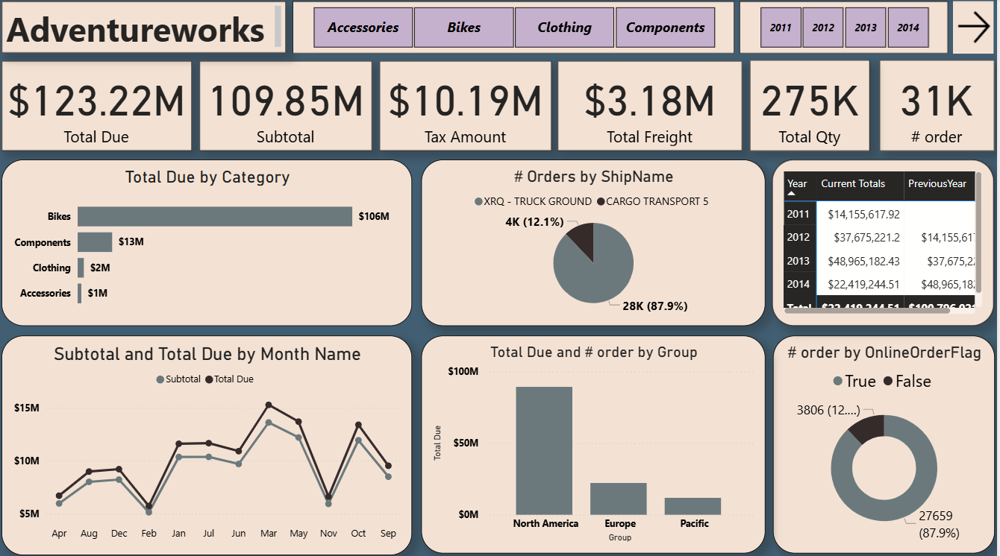
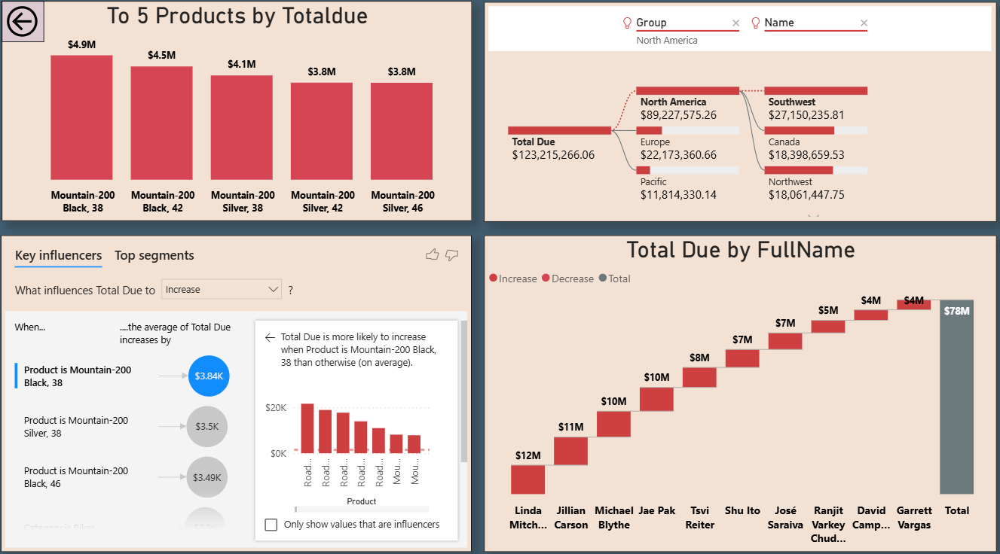

<div align="center">

# 🚀 AdventureWorks Analytics Dashboard

<p align="center">
  
</p>


### Enterprise-Grade Business Intelligence & Data Visualization Platform

[](https://powerbi.microsoft.com/)
[](.)
[](LICENSE)
[](.)

</div>

---

## 📊 Overview

**AdventureWorks Analytics Dashboard** is a comprehensive business intelligence solution designed to provide deep insights into sales performance, product analytics, customer behavior, and operational metrics. Built with advanced data visualization techniques, this dashboard transforms raw business data into actionable intelligence.

### 💡 Key Highlights

- **Real-time KPI Tracking** - Monitor critical business metrics at a glance
- **Multi-dimensional Analysis** - Analyze data across categories, regions, products, and time periods
- **Interactive Visualizations** - Dynamic charts and graphs for deep-dive analysis
- **Predictive Insights** - Key influencers and trend analysis for data-driven decisions
- **Geographic Intelligence** - Regional performance tracking and comparison

---

## 🎯 Features

### 📈 Core Metrics Dashboard



**Live KPIs:**
- 💰 **Total Due**: $123.22M
- 📦 **Subtotal**: $109.85M
- 🧾 **Tax Amount**: $10.19M
- 🚚 **Total Freight**: $3.18M
- 📊 **Total Quantity**: 275K units
- 🛒 **Total Orders**: 31K

### 📊 Advanced Analytics



**Analytical Capabilities:**
- ✅ **Category Performance Analysis** - Track revenue by product categories (Bikes, Components, Clothing, Accessories)
- ✅ **Shipping Analytics** - Monitor order distribution across shipping methods
- ✅ **Temporal Trends** - Analyze subtotal and total due variations monthly
- ✅ **Regional Insights** - Compare performance across North America, Europe, and Pacific regions
- ✅ **Product Rankings** - Identify top-performing products by revenue
- ✅ **Key Influencers** - Discover factors driving business outcomes
- ✅ **Customer Analytics** - Track performance by individual customers

---

## 🛠️ Technical Stack

```
┌─────────────────────────────────────────┐
│     Data Visualization Layer            │
│  ┌────────────────────────────────────┐ │
│  │        Power BI / Tableau          │ │
│  └────────────────────────────────────┘ │
└─────────────────────────────────────────┘
                    ▼
┌─────────────────────────────────────────┐
│      Data Processing Layer               │
│  ┌────────────────────────────────────┐ │
│  │    DAX / SQL / Python              │ │
│  └────────────────────────────────────┘ │
└─────────────────────────────────────────┘
                    ▼
┌─────────────────────────────────────────┐
│         Data Storage Layer               │
│  ┌────────────────────────────────────┐ │
│  │   AdventureWorks Database          │ │
│  └────────────────────────────────────┘ │
└─────────────────────────────────────────┘
```

---

## 📂 Project Structure

```
AdventureWorks-Analytics/
│
├── 📊 Dashboards/
│   ├── Overview.pbix
│   ├── ProductAnalysis.pbix
│   └── CustomerAnalytics.pbix
│
├── 📁 Data/
│   ├── Sources/
│   └── Processed/
│
├── 📜 Scripts/
│   ├── ETL/
│   └── Transformations/
│
├── 🖼️ assets/
│   ├── dashboard_overview.png
│   └── advanced_analytics.png
│
├── 📖 Documentation/
│   ├── UserGuide.md
│   └── DataDictionary.md
│
└── README.md
```

---

## 🚀 Getting Started

### Prerequisites

- Power BI Desktop (Latest Version)
- AdventureWorks Database Access
- Windows 10/11 or macOS with Power BI

### Installation

1. **Clone the repository**
   ```bash
   git clone [https://github.com/yourusername/adventureworks-analytics.git](https://github.com/yourusername/adventureworks-analytics.git)
   cd adventureworks-analytics
   ```

2. **Open Power BI Dashboard**
   ```bash
   # Navigate to the Dashboards folder
   cd Dashboards
   
   # Open the main dashboard file
   start Overview.pbix
   ```

3. **Configure Data Connection**
   - Open Power BI Desktop
   - Go to `Home` → `Transform Data` → `Data Source Settings`
   - Update the connection string to your AdventureWorks database
   - Click `Refresh` to load the latest data

---

## 📖 Usage

### Dashboard Navigation

1. **Overview Dashboard** - Start here for high-level business metrics
2. **Product Analysis** - Deep-dive into product performance and trends
3. **Customer Analytics** - Analyze customer behavior and segmentation
4. **Regional Performance** - Compare metrics across geographic regions

### Interactive Features

- 🔍 **Filter by Date Range** - Use the year selector (2011-2014) to analyze specific periods
- 📊 **Cross-filtering** - Click on any chart element to filter related visualizations
- 🎯 **Drill-through** - Right-click on data points for detailed breakdowns
- 📤 **Export Data** - Export filtered data to Excel for further analysis

---

## 📊 Key Insights

### Business Performance

> **Category Performance**: Bikes lead revenue generation at $106M, followed by Components ($13M), Clothing ($2M), and Accessories ($1M)

> **Shipping Distribution**: 87.9% of orders use standard cargo transport, with 12.1% requiring specialized ground shipping

> **Regional Breakdown**: North America dominates with significant market share, followed by Europe and Pacific regions

> **Top Products**: Mountain-200 series products consistently rank as top performers

---

## 🔧 Customization

### Adding New Visualizations

1. Open the `.pbix` file in Power BI Desktop
2. Navigate to the desired report page
3. Select visualization type from the `Visualizations` pane
4. Drag and drop fields from the `Fields` pane
5. Format using the `Format` pane for consistent theming

### Modifying DAX Measures

```dax
// Example: Calculate Year-over-Year Growth
YoY Growth = 
VAR CurrentYear = [Total Due]
VAR PreviousYear = CALCULATE([Total Due], SAMEPERIODLASTYEAR('Calendar'[Date]))
RETURN
    DIVIDE(CurrentYear - PreviousYear, PreviousYear, 0)
```

---

## 👥 Contributers

| [](https://github.com/anas7abdelghany) | [](https://github.com/A7med668) | [](https://github.com/khloudemad) |
|:--:|:--:|:--:|
| <span style="color:#58a6ff; font-weight:bold;">Anas Abdelghany</span> | <span style="color:#58a6ff; font-weight:bold;">Ahmed Hussein</span> | <span style="color:#58a6ff; font-weight:bold;">Khloud Emad</span> |
| <span style="color:#8ab4f8;">👨‍💻 Data Science Student</span> | <span style="color:#8ab4f8;">👨‍💻 Data Science Student</span> | <span style="color:#8ab4f8;">👨‍💻 Data Science Student</span> |
| [<span style="color:#58a6ff;">🔗 GitHub Profile</span>](https://github.com/anas7abdelghany) | [<span style="color:#58a6ff;">🔗 GitHub Profile</span>](https://github.com/A7med668) | [<span style="color:#58a6ff;">🔗 GitHub Profile</span>](https://github.com/khloudemad) |
