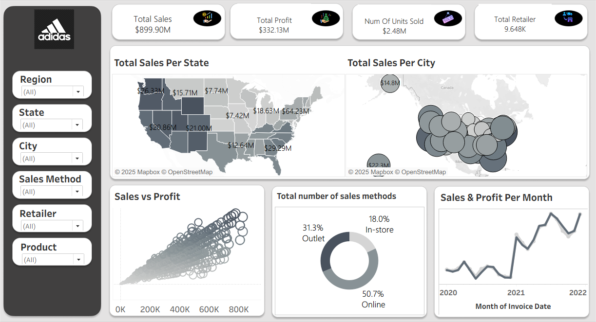
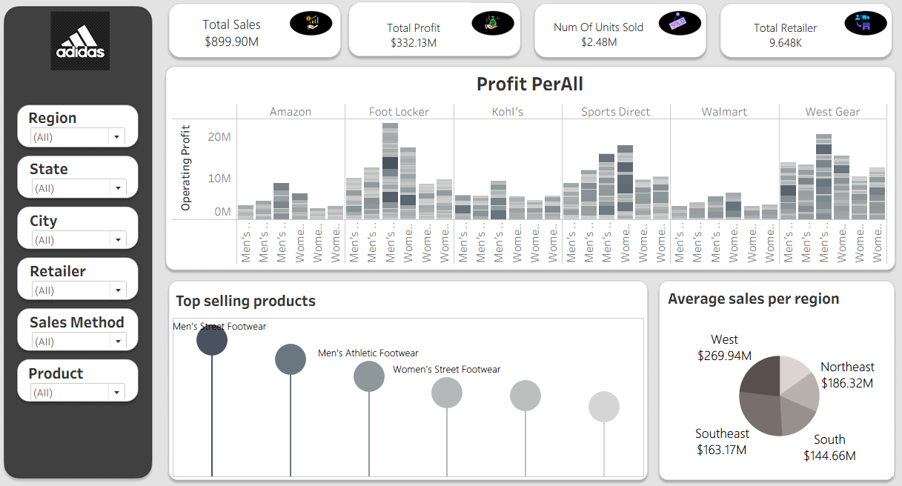
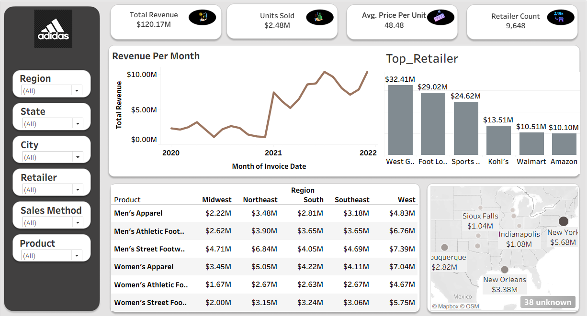

# 📊 Adidas Sales & Profit Analysis Dashboard

  

## 🎯 Project Overview

This project presents a comprehensive interactive dashboard for analyzing Adidas sales performance across the United States. The dashboard provides deep insights into sales trends, profitability metrics, retailer performance, product category analysis, and regional distribution patterns. Built to support data-driven decision-making, this analysis covers sales data from 2020 to 2022, encompassing **$899.90M in total sales**, **$332.13M in profit**, and **2.48M units sold** across **9,648 retailers**.

The dashboard enables stakeholders to:
- Monitor key performance indicators (KPIs) in real-time
- Identify top-performing products, retailers, and regions
- Analyze sales channel effectiveness (Online, Outlet, In-store)
- Track revenue and profit trends over time
- Make informed strategic decisions based on geographic and product insights

---

## 🔍 Key Features & Insights

### 📈 **Dashboard 1: Sales Overview & Performance Metrics**

  

**Key Performance Indicators:**
- **Total Sales:** $899.90M
- **Total Profit:** $332.13M
- **Units Sold:** 2.48M
- **Total Retailers:** 9,648

**Visualizations & Insights:**

1. **Geographic Distribution Maps**
   - **Sales Per State Map:** Visualizes sales concentration across US states with California ($21.00M) and Texas ($20.86M) leading, followed by New York ($64.23M in metro areas) and Florida ($18.65M)
   - **Sales Per City Map:** Bubble visualization showing sales density in major metropolitan areas, with $14.8M in top cities

2. **Sales vs Profit Scatter Plot**
   - Demonstrates positive correlation between sales volume and profitability
   - Clusters indicate different product/retailer performance segments
   - Range: 0K to 800K on the sales axis with proportional profit distribution

3. **Sales Method Distribution (Pie Chart)**
   - **Online:** 50.7% - Dominant channel indicating strong e-commerce presence
   - **Outlet:** 31.3% - Significant contribution from outlet stores
   - **In-store:** 18.0% - Traditional retail still relevant but smaller share

4. **Sales & Profit Per Month (Time Series)**
   - Tracks performance trends from 2020 to 2022
   - Shows notable growth trajectory with seasonal fluctuations
   - Visible acceleration in sales starting mid-2021, reaching peak in late 2022

---

### 🏆 **Dashboard 2: Retailer & Product Performance Analysis**

  

**Key Metrics:**
- **Total Sales:** $899.90M (consistent across dashboards)
- **Total Profit:** $332.13M
- **Units Sold:** 2.48M
- **Retailer Count:** 9,648

**Visualizations & Insights:**

1. **Profit Per Retailer (Stacked Bar Chart)**
   - Compares operating profit across major retailers by gender segments (Men's/Women's)
   - **Top Performers:**
     - **Foot Locker:** Highest profit peaks reaching ~20M in Men's categories
     - **West Gear:** Strong consistent performance across product lines
     - **Sports Direct:** Solid profitability with balanced Men's/Women's mix
   - Analysis covers Amazon, Foot Locker, Kohl's, Sports Direct, Walmart, and West Gear

2. **Top Selling Products (Bubble Chart)**
   - **Men's Street Footwear:** Largest bubble - #1 bestseller
   - **Men's Athletic Footwear:** Second highest sales volume
   - **Women's Street Footwear:** Strong third-place performance
   - Progressively smaller bubbles indicate declining sales volume across remaining categories

3. **Average Sales Per Region (Pie Chart)**
   - **West:** $269.94M (33.6%) - Highest performing region
   - **Northeast:** $186.32M (23.2%) - Second largest market
   - **Southeast:** $163.17M (20.3%) - Growing market
   - **South:** $144.66M (18.0%) - Opportunity for growth

---

### 💰 **Dashboard 3: Revenue Analysis & Product-Region Breakdown**

  

**Key Metrics:**
- **Total Revenue:** $120.17M (specific period analysis)
- **Units Sold:** 2.48M
- **Average Price Per Unit:** $48.48
- **Retailer Count:** 9,648

**Visualizations & Insights:**

1. **Revenue Per Month (Time Series Line Graph)**
   - Tracks revenue trends from 2020 to 2022
   - Notable patterns:
     - Relatively flat performance through 2020
     - Significant dip in early 2021
     - Sharp recovery and growth acceleration from mid-2021
     - Peak revenue (~$10M+) achieved in mid-to-late 2022
     - Some volatility in late 2022 with sustained high performance

2. **Top Retailers by Revenue (Bar Chart)**
   - **West Gear:** $32.41M - Market leader
   - **Foot Locker:** $29.02M - Close second
   - **Sports Direct:** $24.62M - Strong third
   - **Kohl's:** $13.51M - Mid-tier performer
   - **Walmart:** $10.51M - Consistent contributor
   - **Amazon:** $10.10M - Growing online presence

3. **Product Performance by Region (Data Table)**
   Comprehensive breakdown showing sales across five regions (Midwest, Northeast, South, Southeast, West):
   
   | Product Category | Midwest | Northeast | South | Southeast | West |
   |-----------------|---------|-----------|-------|-----------|------|
   | **Men's Apparel** | $2.22M | $3.48M | $2.81M | $3.18M | $4.83M |
   | **Men's Athletic Footwear** | $2.62M | $3.90M | $3.65M | $3.65M | $6.76M |
   | **Men's Street Footwear** | $4.71M | $6.84M | $4.05M | $4.69M | $7.39M |
   | **Women's Apparel** | $3.45M | $5.05M | $4.22M | $4.11M | $7.04M |
   | **Women's Athletic Footwear** | $1.67M | $2.67M | $2.63M | $2.67M | $4.67M |
   | **Women's Street Footwear** | $2.00M | $3.15M | $3.24M | $3.06M | $5.75M |
   
   **Key Insights:**
   - West region dominates across all product categories
   - Men's Street Footwear is the top revenue generator overall
   - Northeast shows strong balanced performance across categories
   - South and Southeast present growth opportunities

4. **Geographic City-Level Revenue Map**
   - Highlights major metropolitan sales hubs:
     - **New York:** $5.68M
     - **Sioux Falls:** $1.04M
     - **Indianapolis:** $1.08M
     - **Duquerque:** $2.82M
     - **New Orleans:** $3.38M
   - Shows **38 unknown** locations indicating data collection opportunities

---

## 🎛️ **Interactive Filtering Capabilities**

All dashboards include comprehensive filtering options:
- **Region:** Filter by geographic region (All regions available)
- **State:** State-level drill-down capability
- **City:** City-level granular analysis
- **Sales Method:** Filter by Online, Outlet, or In-store channels
- **Retailer:** Focus on specific retail partners
- **Product:** Analyze by product category (Apparel, Athletic Footwear, Street Footwear by gender)

These filters enable dynamic exploration and custom analysis based on specific business questions.

---

## 🛠️ Technologies Used

This dashboard project leverages modern data analytics and visualization technologies:

- **Data Visualization Platform:** Power BI / Tableau (Interactive dashboard framework)
- **Data Processing:** Python (Pandas, NumPy) for data cleaning and transformation
- **Geographic Mapping:** Mapbox / OpenStreetMap integration for location-based insights
- **Data Storage:** SQL Database for structured sales data management
- **Statistical Analysis:** Advanced analytics for trend identification and correlation analysis
- **Version Control:** Git/GitHub for project management and collaboration

**Technical Capabilities:**
- Real-time data refresh and updates
- Interactive drill-down and filtering
- Cross-visual filtering and highlighting
- Responsive design for multiple devices
- Export capabilities for reports and presentations

---

## 📊 Dataset Information

**Data Coverage:**
- **Time Period:** 2020 - 2022 (3 years of sales data)
- **Geographic Scope:** United States (State and City level)
- **Retailers:** 9,648 retail locations
- **Sales Channels:** Online, Outlet, In-store
- **Product Categories:** 6 main categories (Men's/Women's × Apparel/Athletic Footwear/Street Footwear)

**Key Data Fields:**
- Sales transactions and revenue
- Profit margins
- Units sold
- Geographic location (State, City)
- Retailer information
- Product categories
- Sales method/channel
- Invoice dates

---

## 💡 Key Business Insights & Recommendations

### **Strategic Findings:**

1. **Digital Transformation Success:** 50.7% online sales demonstrates strong e-commerce adaptation - recommend continued digital investment

2. **Regional Opportunities:** 
   - West region leads at $269.94M - maintain market dominance
   - South region ($144.66M) shows growth potential - target for expansion

3. **Product Strategy:** Men's Street Footwear is the top performer - prioritize inventory and marketing for this category

4. **Retailer Partnerships:** West Gear ($32.41M) and Foot Locker ($29.02M) are critical partners - strengthen these relationships

5. **Seasonal Patterns:** Notable revenue acceleration in 2021-2022 suggests successful initiatives - analyze and replicate success factors

6. **Price Positioning:** Average unit price of $48.48 indicates mid-range market position - consider premium product line expansion

---

## 🚀 Future Enhancements

Potential areas for dashboard expansion:
- [ ] Customer segmentation analysis
- [ ] Inventory turnover metrics
- [ ] Marketing campaign ROI tracking
- [ ] Competitor benchmarking
- [ ] Predictive sales forecasting using ML models
- [ ] Customer satisfaction metrics integration
- [ ] Real-time sales monitoring dashboard
- [ ] Mobile app version for on-the-go insights

## 👥 Contributers

|  |  |  |
|:--:|:--:|:--:|
| Anas Abdelghany | Ahmed Hussein | Khloud Emad |
| 👨‍💻 Data Science Student | 👨‍💻 Data Science Student | 👨‍💻 Data Science Student |
| [🔗 GitHub Profile](https://github.com/anas7abdelghany) | [🔗 GitHub Profile](https://github.com/A7med668) | [🔗 GitHub Profile](https://github.com/khloudemad) |
